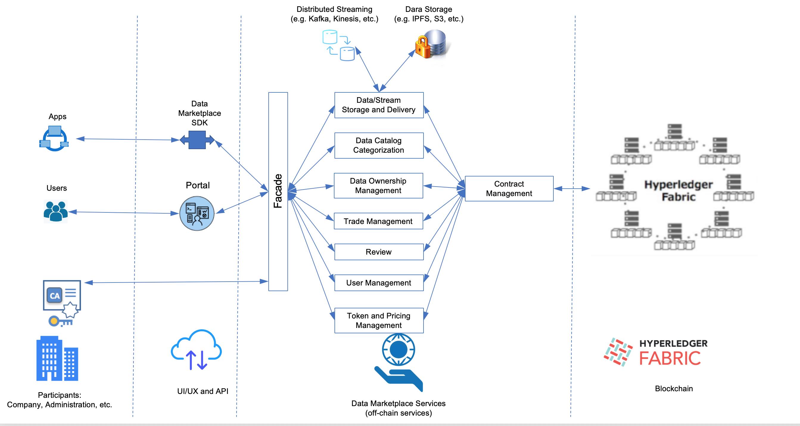

# DataGraviti: 
## A Data Marketplace based on Hyperledger Fabric
This repository contains the root repository of the data marketplace initiative.

DataGraviti is a decentralized data marketplace based on Hyperledger Fabric, a blockchain framework implementation hosted by The Linux Foundation. The purpose of the developed data marketplace is to ensure data exchange in a decentralized setting between data providers and consumers organized into a consortium. The data marketplace is permissioned, enterprise grade, decentralized data exchange platform for data professionals and industry consortiums who value control and privacy.  

The platform takes the most of Hyperledger Fabric by implementing a chaincode (smart contract) that enforce data ownership and protect privacy in data exchange. It uses an overlay of decentralized severs built on top of Hyperledger Fabric to ensure data cataloging, data storage and data stream delivery. The platform is also provided with a portal to be used by end users to browse, search, buy, sell and consume data (in different forms). 

The platform should be operated by a consortium of data players who are willing to exchange and monetize data including not only selling and buying but also processing data.

## Architecture overview

## DataGraviti detailed services

### Environment Setup

We used Hyperldger Fabric as an underlying blockchain infrastructure to support the data marketplace.
In this use case, we were inspired by the open source community deployment tutorials to deploy Fabric on top of Kubernetes.
Specifically, we followed [this tutorial](https://github.com/IBM/blockchain-network-on-kubernetes#4-deploy-hyperledger-fabric-network-into-kubernetes-cluster).
The new deployment artifacts and scripts that we created are in this repository:
[data-marketplace-hyperledger-fabric](https://github.com/lgsvl/data-marketplace-hyperledger-fabric).

### Hyperledger Chaincode
The [Data marketplace chaincode](https://github.com/lgsvl/data-marketplace-chaincode) is a smart contract that defines and manages the different concepts of the data marketplace business. It allows providers to publish their data and consumers to buy. The covered data types are [files](https://github.com/lgsvl/data-marketplace-file-delivery) and [streams](https://github.com/lgsvl/data-marketplace-stream-delivery). The chaincode is written for Hyperledger Fabric using Go language. If you want to be deployed on a Fabric network, you can follow and use the scripts we have in this [repository](https://github.com/lgsvl/data-marketplace-hyperledger-fabric).

### Chaincode REST interface
The chaincode itself is deployed on top of a Hyperledger Fabric network. In order to use the chaincode, we implemented a rest interface that allows to execute all kinds of offered features. The chaincode REST interface is described in this [repository](https://github.com/lgsvl/data-marketplace-chaincode-rest).

### File-based data delivery service
Providers and customers can exchange two types of data in the data marketplace, files and streams. For the file exchange the data can be shared through a third party platform. In this work, we implemented a file exchange based on IPFS. The code that enables file exchange in the data marketplace is in this [repository](https://github.com/lgsvl/data-marketplace-file-delivery).

### Stream-based data delivery service
Providers can also sell streams of data in two types: Pull based and Push based.
The Pull based streaming is when the marketplace platform handles the retrieval of the data from a given source offered by the provider. In this case, the data stream delivery services periodically collects the data and publishes to the customers.
The Push based streaming is where the provider is responsible of sending the data directly to an agreed upon endpoint where the consumers can get it. In our work, we used Kafka as the data vehicle for streaming. For both cases, Pull and Push the data shared with the customers through Kafka topics. More details about the deployment and the API are in this [repository](https://github.com/lgsvl/data-marketplace-stream-delivery).
We also shared the manifests that we used to deploy kafka, kafka REST proxy and zookeeper in this [repository](https://github.com/lgsvl/data-marketplace-deployment) so that they can be useful for others.

### Data marketplace Facade service
The [facade](https://github.com/lgsvl/data-marketplace-facade) plays somehow the role of a reverse proxy that routes the calls coming from the portal to the right services. Any extra checks and validations could be easily added to the facade. 

### Data marketplace Elastic Search Feeder
This [component](https://github.com/lgsvl/data-marketplace-esearchFeeder) is responsible of feeding Elastic Search with the needed data from the chaincode. This data will be used later to search data based on some context from the portal side. This component collects data periodically and adds it to elastic search to avoid excessive costly access to the blockchain. 

### Web Portal
The [portal](https://github.com/lgsvl/data-marketplace-portal) is the main entry point of the data marketplace because it orchestrates all the calls to the different components and abstracts the difficulties behind managing the chaincode. The portal is written in Angular and makes the right calls to the different components of the marketplace. In order to run the portal you need to have all the other components up and running.

### CI/DC pipeline
In order to help getting started and reusing the data marketplace, we shared our [development pipeline](https://github.com/lgsvl/data-marketplace-pipeline) that uses concourse to run the tests for the different components of the platform, build docker images, pushes them to the registry and deploy the latest code to Kubernetes. We installed concourse following this [repository](https://github.com/concourse/concourse-docker).

### Contribution
To contribute, follow the guidelines in [Contribution guide](contribution-guide.md)

### Support
For any questions, suggestions, or issues, use Github.

### List of Contributors
[Samir Tata](https://www.linkedin.com/in/samirtata/), LG Electronics \
[Mohamed Mohamed](https://www.linkedin.com/in/mohamedmohamedphd/), LG Electronics \
[Gina Baek](https://www.linkedin.com/in/gina-baek-9161bb30/), LG Electronics \
[Faisal Mohammad](https://www.linkedin.com/in/faisalmohammad27/), LG Electronics \
[James Hazen](https://www.linkedin.com/in/jim-hazen-204a741/), LG Electronics \
[Jacob Song](https://www.linkedin.com/in/jacob-song-1bb2301/), LG Electronics \
[Angela Lau](https://www.linkedin.com/in/angelal/), LG Electronics \
[Jae Young Jung](https://www.linkedin.com/in/designerjae/), LG Electronics \
[Lily Hu](https://www.linkedin.com/in/lilyhusf/), LG Electronics 

### License
Copyright 2018, 2019 LG Electronics.

Licensed under the Apache License, Version 2.0 (the "License");
you may not use this file except in compliance with the License.
You may obtain a copy of the License at

http://www.apache.org/licenses/LICENSE-2.0

Unless required by applicable law or agreed to in writing, software
distributed under the License is distributed on an "AS IS" BASIS,
WITHOUT WARRANTIES OR CONDITIONS OF ANY KIND, either express or implied.
See the License for the specific language governing permissions and
limitations under the License.
